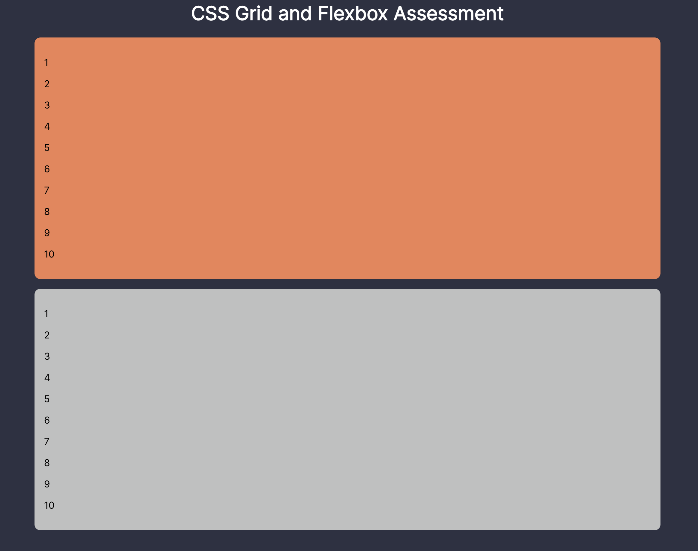
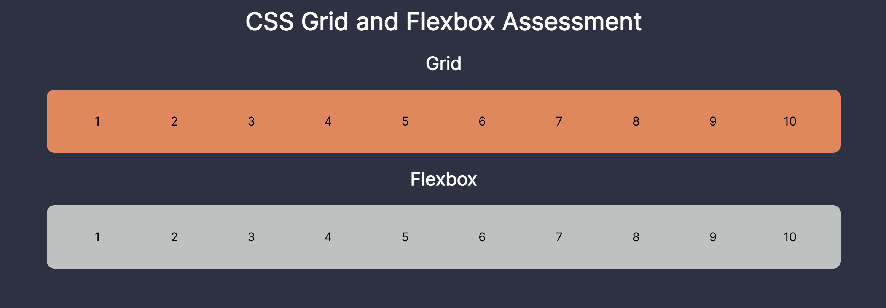

# CSS Flexbox and Grid

This application serves as a basic demonstration of Grid and Flexbox, two key CSS styling concepts that are essential for setting up webpage layouts. We'll be consulting `basics.html` and `basics.css`, which are in our `basics` folder, throughout this README - for more advanced examples, you can check out the files in the `flex` and `grid` folders. There is also an assessment at the end of this README - to complete that, you'll use the files in the `assessment` folder.

## Grid

We'll start off by talking about **Grid**, as it's often the best choice for designing the overall layout of your webpage. You can use Flexbox to design everything, but Grid will likely make your life much easier.

### Declaring a Grid
Let's open up `basics.html` in our browser and take a look at it. You should see something like this:


What do we have here? Well, it's a grid of many-colored rectangles (albeit an uneven grid). If you look in our `body.html` file, you should see several `divs` nested inside of our `body` tag, with `ids` like `"row-one-column-one"`. Each of these `divs` corresponds with one of the colored rectangles in the image above. We've given each of them a specific place in a grid that we've defined on our `body` tag.

If you look at `basics.css`, you'll see something similar to the following code:

```
body {
  display: grid;
  grid-template-rows: 10vh 15vh 20vh 55vh;
  grid-template-columns: 10vw 15vw 30vw 45vw;
}
```

Setting the `display` attribute to `grid` for our `body` allows us to divide our `body` into different rows and columns, which together make up a grid. We declare the different rows and columns in our grid using `grid-template-rows` and `grid-template-columns`. In the above example, we've given our `body` tag's grid four rows, one that is `10vh` tall, one that is `15vh` tall, another that is `20vh` tall, and a final one that is `55vh` tall (together, these add up to `100vh`, which corresponds with 100% of the height of our viewport). We've done something similar for our columns, except their total width adds up to the total width of our viewport.

When setting rows and columns, the left-most value will correspond with the top row and the left-most column, while the right-most value will correspond with the bottom row and the right-most column. The top row and and left-most column will be row `1` and column `1`. The row second from the top and the column second from the left will be row `2` and column `2`. This pattern continues as you create rows and columns.

### Placing Elements Within a Grid

Now that we've given our `body` tag a grid, we can place child elements of that `body` tag within its grid.

Note: this will only work for child elements that are immediate children of our `body` tag. Trying to place elements that are nested within children of our `body` tag within our `body` tag's grid will not work. In other words, in order for an element to be placed in a grid, its immediate parent element must be declared as a grid and given rows and columns.

Once that's been set up, you can tell your element which row and which column it's supposed to belong to in its parent element's grid. Let's take a look at our `basics.css` file. Find the selector that is selecting the `div` with the `id` `row-one-column-one`. It should have the following styles applying to it:

```
#row-one-column-one {
  background-color: hsl(30, 50%, 50%);
  grid-row: 1;
  grid-column: 1;
}
```

Check out `basics.html` in your browser - this div corresponds with the orange rectangle you should be seeing in the upper left-hand corner of your screen. It is `10vh` tall and `10vw` wide - the same height and width as the first row and column in the grid we've set on our `body` tag. Why is this?

Well, if you look at our CSS styles, you'll see that we've given this div a style of `grid-row: 1;` and `grid-column: 1;`. This tells this div that it should position itself within the first row and first column of its parent container's grid. If we wanted it to display in a different row or column, we would simply change the number associated with `grid-row` or `grid-column` (but make sure that the number actually does correspond with a row or column in the parent element's grid).

But what if we want an element to span multiple rows and columns? Fortunately, CSS makes that pretty easy. Let's take a look at where we're selecting our `row-two-column-two-through-four` `div` in our `basics.css` file. It should be receiving the following styling attributes:

```
#row-two-column-two-through-four {
    background-color: hsl(200, 50%, 70%);
    grid-row: 2;
    grid-column: 2 / span 3;
}
```

This div corresponds with the light-blue rectangle that we see in our browser. As you can see, it spans multiple columns, stretching all the way to the right-hand border of our viewport. If we look at our styles, we see why - we've given this `div` a `grid-column` style of `2 / span 3;`. This is telling this `div` that it starts in `column 2` of our parent element's grid, and spans 3 columns in total (which takes us to the edge of our grid, since there are only 4 columns in our grid). This is shorthand for writing:

```
grid-column-start: 2;
grid-column-end: 5;
```

Note that `grid-column-end` - along with `grid-row-end` - takes a value that is _not_ included in the number of columns spanned by your element (there is no column 5 in this instance). The above styling instructions would tell our element to start on `column 2` and span every column _up to but not including_ `column 5`. Play around with it yourself to make sure you understand this concept.

This same principle applies for rows. If we check out the styles we're giving our `row-three-through-four-column-two` div, we'll see similar row stylings in action:

```
#row-three-through-four-column-two{
    background-color: hsl(170, 50%, 50%);
    grid-row: 3 / span 2;
    grid-column: 2;
}
```

### Grid Gap

We can also give our grid gaps in between its rows and columns. Note that this _does change the overall width and height of our grid_. This means that if we have a grid whose width and height spans the width and height of the screen, adding gaps will make our grid larger than the width and height of our screen, which will necessitate scrolling to view the total webpage layout. This is generally not a good idea (we want user to scroll across specific portions of our webpage, rather than across our entire web page itself), so it's good to keep this in mind if you want to add gaps to your grid.

Adding gaps is fairly straightforward. To add a gap between rows, we use the `row-gap` styling attribute and give it a value (say `20px`). For a gap between columns, we use `column-gap`. As a shorthand, we can just use the `gap` styling attribute. If we give it one value (`10px`), both rows and columns will have a gap of `10px`. If we give it two values (`10px 20px`) our rows will have a gap associated with the first value (`10px`) while our columns will have a gap associated with the second value (`20px`). Play around with this yourself to get a feel for it.

Syntax:
```
body {
    display: grid;
    grid-template-rows: 10vh 15vh 20vh 55vh;
    grid-template-columns: 10vw 15vw 30vw 45vw;
    /* You do not need to include all of the gap stylings written below. This just serves as an example for each type of gap styling syntax. */
    row-gap: 20px;
    column-gap: 30px;
    gap: 10px 20px;
    gap: 20px;
}
```
### Nested Grids

As you'll no doubt soon encounter, you're going to need specific layout stylings for individual portions of your webpage, rather than just one basic layout styling for your entire webpage. Fortunately, we can have grids inside of other grids - one element that is supposed to serve as a grid container for other elements may itself have a place in a larger grid structure. Setting this up is actually pretty straightforward.

First things first, let's visit our `basics.html` and comment in our `#header` `div`, our `#sidebar` `div` and our `#content` `div` (leave the `img` tags inside of our `#content` `div` commented out for now - you'll need to comment in both the opening `div` tag and the closing `div` tag for our `#content` `div`). Once you've done that, your webpage should look something like this: 


All of these `div` tags we've commented in are children of our `#row-three-through-four-column-three-through-four` `div`. If we check out our `basics.css` file, we'll see that we've given our `#row-three-through-four-column-three-through-four` `div` a Grid and all of its child elements a place within that Grid:

```
#row-three-through-four-column-three-through-four {
    background-color: hsl(100, 50%, 90%);
    grid-row: 3 / span 2;
    grid-column: 3 / span 2;

    display: grid;
    grid-template-rows: 15vh 60vh;
    grid-template-columns: 15vw 60vw;
}

#header {
    grid-row: 1;
    grid-column: 1 / span 2;
}

#sidebar {
    grid-row: 2;
    grid-column: 1;
    background-color: hsl(100, 50%, 60%)
}

#content {
    grid-row: 2;
    grid-column: 2;
    background-color: hsl(100, 80%, 80%);
}
```

You'll notice that, in addition to giving `#row-three-through-four-column-three-through-four` a Grid, we're first telling it where its supposed to display inside of its parent container:

```
grid-row: 3 / span 2;
grid-column: 3 / span 2;
```

As its `id` describes, its positioned to span the 3rd and 4th row and the 3rd and 4th column in our parent grid. Once we've positioned it within our parent container, we can give it its own internal grid: 

```
display: grid;
grid-template-rows: 15vh 60vh;
grid-template-columns: 15vw 60vw;
```

Now, all of its child elements - `#header`, `#sidebar`, `#content` - will be able to reference this grid when determining their own position.

There is no limit to how deeply you can nest your grids - whatever best meets the needs of your individual use!

### Justifying and Aligning Elements

One other incredibly handy feature that Grid gives us is the ability to align and justify items. For anybody who has struggled to center HTML elements within other elements, worry no more! Grid makes this type of thing easy and straightforward. We'll be working with our `#header` `div` as well as the `h1` inside of our `#header`. If you look at our code in `basics.css` you should see that both are already being selected - each should also have commented out styling attributes within their styling instructions.

Using Grid styling attributes, we'll be manipulating the position of our `h1` inside of our `#header`. You should be able to see these changes in our browser window as we make them (if you don't have an auto-reload on your browser every time you save changes in your files, make sure you're refreshing your browser window).

The first thing we'll need to do is give our `#header` `div` a display of `grid` (there should be code you can comment in that does so). You _must_ give your parent element a display of Grid in order to use the following styling attributes. It doesn't need to have specific rows or columns, but it must be declared as a grid.

#### Align and Justify Items and Content

##### Items
Let's imagine that we want our `h1` to be horizontally and veritcally centered in our `#header` `div`. We can give our `#header` `div` styling attributes that tells child elements how they should position themselves within the grid (or within their respective grid-rows and grid-columns). To vertically position child elements, we're going to use the `align-items` attribute. To horizontally position child elements, we're going to use the `justify-items` styling attribute. Let's give our `#header` `div` both of those styling attributes and set their values to `center`:

```
#header {
  grid-row: 1;
  grid-column: 1 / span 2;
  
  display: grid;
  align-items: center;
  justify-items: center;
}
```

Once you've applied those styles, your `#header` `div` should look something like this:


In addition to `center` we can also use `start` and `end` in conjunction with `align-items` and `justify-items`. `start` corresponds with `top` and `left`, while `end` corresponds with `bottom` and `right`, respectively.

##### Content

There are actually two separate commands for handling this type of display manipulation in Grid - in addition to `align-items` and `justify-items` we have the styling attributes `align-content` and `justify-content`. While these two attributes may seem similar on the surface, they have a significantly different result. Moreover, `aligning` or `justifying` `content` will override `aligning` or `justifying` `items` - it also can't be overridden by `aligning` or `justifying` `self`, which is what we'll discuss in the next section.

Let's add another `h1` tag to our `#header` `div` in our `basics.html` file (we can just copy paste the existing `h1` tag). With the styling attributes we currently have, our `#header` `div` should look like this:


Our items are center aligned, but there's a substantial gap between them. What if we wanted them to bunch together at the center, separated only by the margin that we've given them (they currently have no margin)? That's where we can use `align-content`:

```
align-content: center;
```

Let's add that to our `#header` `div` styling instructions (we can remove our `align-items` styling instructions, although `align-content` will automatically override it). Our `#header` `div` should now look like this:


Let's test this out for `justify-content` as well. First things first, let's make sure our `h1` tags are displayed horizontally adjacent to each other. We can do this by telling them that they both belong to the same row (which in this case is row `1`, since we haven't actually given our Grid any specific rows).

```
#header h1 {
  grid-row: 1;
}
```
Our `#header` should now look like this:


This is similar to the issue we were facing when we just used `align-items` instead of `align-content`. Let's add `justify-content: center;` as a styling instruction to our `#header` `div`. Once we've added it, our `#header` `div` should look like this:


#### Align-Self and Justify-Self

`align-items`, `align-content`, `justify-items`, and `justify-content` are great for controlling the position of _all_ child elements within a grid - but what if we want to just target one specific element and tell it how to position itself within its parent Grid?

In these instances we can use the `align-self` and `justify-self` attributes on a child element of our grid container (in this example, we're going to be giving the `h1` inside our `#header` `div` these styles).

`align-self` is used for vertical alignment, while `justify-self` is used for horizontal alignment. Both of these styling attributes can override `align-items` and `justify-itmes` that has been set on the parent element. They _cannot_, however, override `align-content` and `justify-content. Let's give one of our `h1` elements an `id` of `#end-header`, comment out our `align-content` and `justify-content` styles on our parent Grid, and give these styles to our to our specific `end-header` div:

```
#header #end-header{
  align-self: end;
  justify-self: end;
}
```

We should now have something that looks like this (if you've been changing other styling elements, you might have something a little different):


As expected, our `align-self` and `justify-self` attributes we've given our `#end-header` are overriding `align-items` and `justify-items` and giving our `#end-header` a new position. If we comment back in our `align-content` and `justify-content` instructions on our `#header` `div`, we'll see that our `align-self` and `justify-self` properties no longer apply, since `align-content` and `justify-content` take precedence.

### Viewing Grids in Chrome Dev Tools

Any element we give a display of Grid will have that reflected in our Chrome Dev tools. If we check out the elements tab in our dev tools, we should see something like this:


As you can see, the elements that have a display of "grid" are marked with a grid button in our dev tools. If we click on that button (let's click on the one next to our `body` tag), we'll see that grid overlayed on our webpage: 


### Summary

Here's a great image encapsulating the different way positional grid commands affect the layout of your webpage: 


## Flexbox

While Grid is an incredibly handy and useful tool for layouts, Flexbox is also an essential styling technique to have in our toolkit. Most of the time, we'll use both styling attributes when setting up a single page. (Which is what we'll be doing here!) 

Flexbox is a great option when you want something more, well, _flexible_ than a grid - i.e. when you want to control the layout of items (perhaps a set of images, cards, or other pieces of content) without placing them within a strict grid framework. Flexboxes are great in that they will also automatically flex and resize based on the width of the viewport on which they're being displayed. Items inside of Flexboxes (also known as flex items) will readjust their layout when a Flexbox resizes, although they'll keep following the same general principles.

We'll be turning our `#content` `div` into a Flexbox in order to control the display of the `img` tags we've included inside of it. First things first, let's comment in those image tags. Once they're commented in, you should see them showing up on our webpage:


### Declaring a Flexbox

Declaring a Flexbox is quite similar to declaring a Grid. You simply choose the parent element that you want to become a Flexbox (in this case, our `#content` `div`) and give it a `display` of `flex`:

```
#content {
    grid-row: 2;
    grid-column: 2;
    background-color: hsl(100, 80%, 80%);

    display: flex;
}
```

You should see an immediate effect - our webpage will now look like this: 


Yikes! All of our images are now displaying on a single row that goes off screen - that doesn't look like what we want! 

Don't panic - this is just what happnes when we first declare a Flexbox. All of its child elements - or "Flex items" - will display inline. This is actually desired behavior; it allows us to display block level elements - like `div`s - side by side, instead of on a whole new line. We can use Flexbox's many styling attributes to further control the layout.

### Flex Direction

We can give our Flexbox a `flex-direction` attribute, which will instruct it how to organize its Flex items. By default, each Flexbox has a `flex-direction` of `row`. We can also change our flex-direction to `row-reverse`, which switches the order in which our elements display; `column`, which organizes our elements into a column; and `column-reverse`, which also organizes our elements into a column, but switches the order in which elements are displayed. Here's what our webpage would look like if we gave our `#content` `div` a `flex-direction` of `column`:


### Flex Wrap

Ok, so we can change the direction in which our Flexbox organizes its Flex items. But we still have everything displaying in one long row or column. How do we change that?

Flexbox makes it pretty easy - it give us the `flex-wrap` property. By default each Flexbox is assigned a `flex-wrap` of `no-wrap`. This results in a display similar to what we're currently seeing - either one long row or one long column, depending on the `flex-direction` that we've set. But, we can tell our Flex items to wrap around into new rows and columns by giving our `flex-wrap` attribute a style of `wrap`. First, let's revert our `flex-direction` back to a `row`. Next, let's apply these styles to our `#content` `div`:

```
flex-wrap: wrap;
```

Now, we should be seeing something like this: 


Great! Our content is now wrapping around to create a new row instead of overflowing off the side of our screen.

### Flex gap

Like Grid, Flex allows us to set a gap between different Flex items. We can do this using the `row-gap`, `column-gap`, and `gap` properties. `row-gap` sets the gap for rows, `column-gap` sets the gap for columns, and `gap` can be used as a shorthand to specify both. We can pass `gap` either one or two values - passing it one value will set the same gap for rows and columns alike. Passing two values will set the row gap based off the first value and the column gap based off the second value.

```
gap: 20px 10px;
```

The styles above will give our Flexbox a gap of `20px` between its rows and `10px` between its columns. Note that this does not affect the distance between the edge of your container and your flex-items. For that, you will likely use `padding` or `justify` or `align` your Flex items.


### Justifying and Aligning

The principles for justifying and aligning Flex items within a flexbox is very similar to Grid - you can use `justify-content`, `align-items`, and `align-content`. However, there is no `justify-items` for Flexbox. (There is also no `justify-self` property for Flex items). 

Additionally, instead of using `start` or `end` to tell items to position themselves at the top or bottom / left or right in a container, we use `flex-start` and `flex-end`. So, if we wanted our Flex items to horizontally position themselves toward the right of our Flex container, we would write:

```
justify-content: flex-end;
```

Which would result in a display like this:


We also have some other styling attributes, like `space-between`, `space-around`, and `space-evenly`. Try playing around with each of these to see what effects they produce.

#### Align-self

As mentioned, there is no `justify-self` property in Flexbox. However, there is still `align-self`, which allows us to override `align-items` (but not `align-content`). We apply `align-self` on Flex items themselves, as opposed to on the parent Flexbox container.

Let's give our `.doggo` styles an `align-self` property of `flex-end` (make sure there are no conflicting `align-content` instructions on the parent Flexbox).

```
.doggo {
    height: 150px;
    width: 200px;
    object-fit: cover;
    align-self: flex-end;
}
```

You should see something like this:


## Conclusion

And that's it for Flexbox and Grid! I want to give my page some final stylings to make sure it's in good shape. I'm going to remove that 'align-self' property from `.doggo`, and give `#content` the following styles to produce my final desired effect:

```
#content {
    grid-row: 2;
    grid-column: 2;
    background-color: hsl(100, 80%, 80%);
    padding-top: 10px;
    display: flex;
    flex-flow: row wrap;
    justify-content: center;
    align-content: flex-start;
    gap: 10px;
}
```

My final page should look like this:


## Assessment
This is a challenge assessment to help you understand the concepts of CSS Flexbox and Grid. You will be asked to modify a simple CSS file that will be used to style a simple HTML file. Initially, both the flex and grid container divs are not quite right. They look something like this:



Using your knowledge of CSS Flexbox and Grid, modify the CSS file to make the flex and grid container divs look like the following:



Remember that there are many ways to solve this challenge. The only requirement is that you modify the CSS file to make the flex and grid container divs look like the second image. After completing this challenge, you will be able to:
- Use CSS Flexbox and Grid
- Use CSS Flexbox and Grid to create simple layouts
- Use CSS Flexbox and Grid to make complicated layouts more manageable

Switch to the "possible-solution" branch after completing the challenge to see a possible solution.
